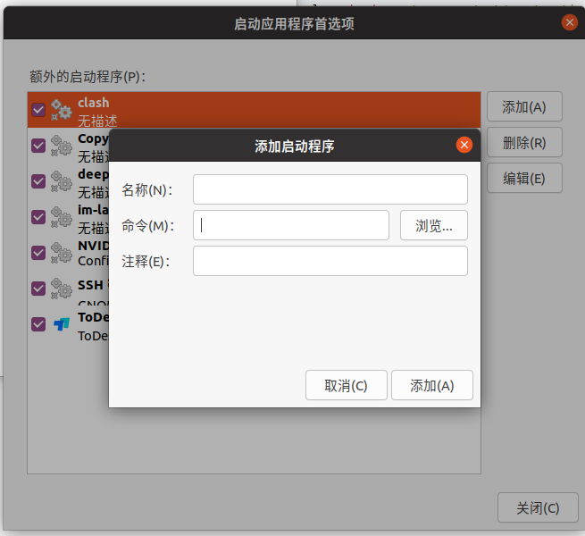

# ROS开机自启动

注意，开机自启动只能执行不需要root权限的指令，而且需要开机自动登陆

## ros官方方案

通过robot_upstart将launch文件添加到开机自启动中，如需串口等端口，需进行额外配置

### 安装robot_upstart

```bash
sudo apt install ros-noetic-robot-upstart
```

### 配置开机自启动

```bash
#rosrun robot_upstart install [pkg-name]/launch/[launch-name].launch
#示例
rosrun robot_upstart install follow_driving/launch/follow_driving.launch
```

### 关闭开机自启动

```bash
#sudo service [服务名] stop
#示例
sudo service follow stop
```

### 关闭后重新开启

```bash
#sudo service [服务名] start
#示例
sudo service follow start
```

### 查看服务状态

```bash
#sudo service [服务名] status
#示例
sudo service follow status
```

### 卸载服务

```bash
#rosrun robot_upstart uninstall [服务名]
#示例
rosrun robot_upstart uninstall follow
```

## 通用方案

通过创建sh脚本并添加到开机启动项中，可实现任何命令的开机自启动

### 创建sh脚本

内容如下，其中‘‘中为启动命令行后自动输入的代码

```shell
#! /bin/bash

gnome-terminal -- bash -c 'source /opt/ros/noetic/setup.bash;source ~/catkin_ws/devel/setup.bash;roslaunch follow_driving follow_driving.launch' #新建终端启动节点
sleep 8 #等待8秒
gnome-terminal -- bash -c 'source /opt/ros/noetic/setup.bash;rosrun turtlesim turtlesim_node'
wait
exit 0
```

### 赋予脚本执行权限

```bash
sudo chmod 777 xx.sh
```

### 测试脚本是否能正常工作

```bash
./xx.sh
```

### 设置为开机自启动

```bash
#打开开机自启动设置界面
gnome-session-properties
```



名称与注释任取，命令通过浏览找到书写的xx.sh文件
