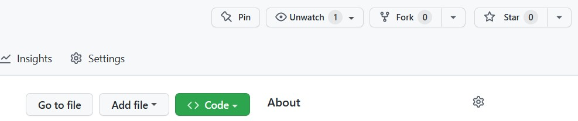
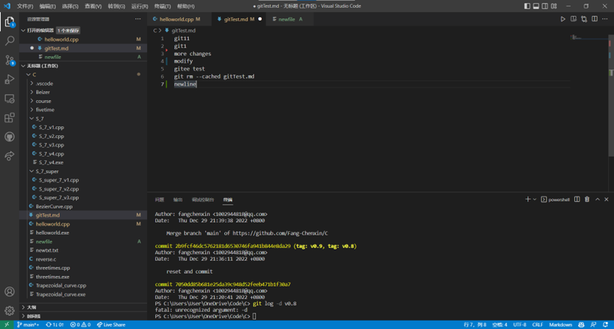
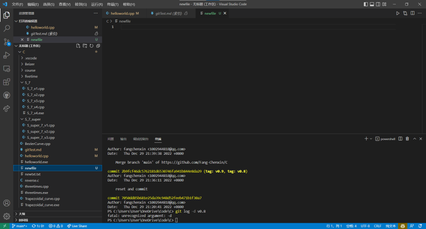

# 简介

本文是面向零基础者的Git入门教程，内容较为基础简单，主要来源于各种资料整合以及个人使用经验，仅作基本了解性介绍。内容基本涵盖Git常用操作，以各种命令为中心，逐一解释其用法和注意事项。另附在VScode利用其辅助功能使用Git的介绍。

# 基本概念

## 关于Git

Git是一个开源的分布式版本控制系统，用于敏捷高效地处理任何或小或大的项目。Git在全球范围被广泛使用，主要用于代码开发过程中的版本管理，Git每个版本所储存的是不同版本文件的修改内容，因此相比于备份保存各个版本可以节省很多空间，尤其是版本数量极多的情况下。自然地，作为版本控制系统，Git也可以方便地回退到之前的版本。Git基于修改内容的存储方法也使得Git可以显示出不同版本间内容的差异，快速找到团队中其他人修改的部分。

## 空间

Git管理的空间可以分为三部分，工作区、暂存区和版本库。

* 工作区：即在电脑里能看到的目录，能够直接进行操作编辑修改的部分。若不使用Git相当于只有这部分空间，此部分空间与无Git时无异。

* 暂存区：英文叫stage或index。一般存放在.git目录下的index文件（.git/index）中，所以我们把暂存区有时也叫作索引（index）。暂存区是工作区到版本库之间的过渡，将文件加到暂存区的过程相当于是选择需要放入版本库的文件，在执行提交命令时所有暂存区中的文件都会被移至版本库。

* 版本库：工作区有一个隐藏目录 .git，这个就是Git的版本库。在文件管理器中选择显示隐藏文件可以看到.git文件夹。这里存储了之前提交的各个版本的文件，是Git最核心的空间。它也被称为资源库、仓库。

一个完整的Git上传过程是文件从工作区进入暂存区保存到版本库的过程，通常文件不会在暂存区停留很久，一般在将所需文件都加入到暂存区后会立刻接着提交到版本库。


## 版本树

每个版本（也称快照）都被使用哈希值标记，并且附有每次提交都强制要求填写的注解。可以使用命令或辅助软件查看其中存储的内容，版本间的相对关系被称为版本树，可以通过图形化工具看到版本树的图形表示，在命令行中则显示每个版本的父版本。某些操作会使版本从版本树上消失，但总是可以通过哈希值访问到相应版本。

## 分支

在不使用分支等命令时，版本树是按时间先后排列的线性结构，而分支则使版本树出现分叉，成为真正的树形。分支可以允许用户在某个特定版本的基础上做出不同修改，并可以将这些分支合并，可以创建多个分支，分别由不同人负责开发各个功能模块，并在完成后合并各分支修改，实现并行开发。

## HEAD指针

HEAD指针指向目前所操作的Git版本，改变HEAD指针的位置的过程就是回退、恢复、切换分支的过程。在默认情况下HEAD指针指向最新的版本，可以使用命令切换HEAD指针指向，实现在不同版本间的切换。在切换所操作的分支时需要将HEAD指针指向目标分支，分支本身实际上也是一个指向它所在分叉上最新版本的指针。

## 远程仓库

Git可以在本地建立一个版本管理仓库，也可以将这个仓库共享到远程服务器上，如Github、Gitee等平台，在云端保存代码或是将代码共享给更多人。Github是最大最热门的平台，但国内连接时可能会有一定的困难，而Gitee连接相对更为稳定。在云端保存代码时要注意不要使用amend、undo、redo之类修改历史记录的命令，防止同一版本不同人获取到的内容不一致，应当提交新一版以代替此类行为。

# 相关资料

以下列出了一些介绍Git的资料链接，仅供参考，根据个人情况选择。

[菜鸟教程](https://www.runoob.com/git/git-tutorial.html)：列出了Git中常用的命令，并对于必要的概念做出了清晰解释。可先大致浏览以对Git有一个基本了解，也可在使用中随时查阅所需内容。若要查看所有命令可至Git官网。

[Git闯关式学习](https://learngitbranching.js.org/?locale=zh_CN)：熟悉Git操作，强化对版本树的概念理解。每关前都有带动画演示的说明，并且在关卡内练习指定操作，此教程对版本树变更做了可视化处理以便理解。教程内容覆盖除配置Git外的几乎所有常用命令。

[约定式提交](https://www.conventionalcommits.org/zh-hans/v1.0.0/)：使你的提交信息更规范更具可读性，若仅为个人备份文件而使用Git可随意。

Git 各平台安装包下载地址（Git官网）：http://git-scm.com/downloads

以下分别选取了通过Git Bash、Vscode终端、GitKraken图形化界面等三种方式使用Git的介绍视频各一，可大致了解其异同。Git Bash、Vscode终端都使用Git命令行，操作基本一致，图形化界面对操作方式有较大改变，不同软件的操作也有所区别，目前有多种Git图像化界面，可自行选择感兴趣的进行深入了解。

*******************************************************************************

**Git介绍视频：**
Git Bash（Git自带的命令行方式）：[git、github 保姆级教程入门，工作和协作必备技术，github提交pr - pull request](https://www.bilibili.com/video/BV1s3411g7PS/?spm_id_from=trigger_reload&vd_source=a4e5f980d5f72ee9cf4a10444b1b5eda)

使用Vscode终端：[『教程』简单明了的Git入门](https://www.bilibili.com/video/BV1Cr4y1J7iQ/?spm_id_from=333.788.recommend_more_video.0&vd_source=a4e5f980d5f72ee9cf4a10444b1b5eda)

GitKraken图形化界面：[Git + GitHub 10分钟完全入门](https://www.bilibili.com/video/BV1KD4y1S7FL/?spm_id_from=333.337.search-card.all.click&vd_source=a4e5f980d5f72ee9cf4a10444b1b5eda)、[Git + GitHub 10分钟完全入门 (进阶)](https://www.bilibili.com/video/BV1hA411v7qX/?vd_source=a4e5f980d5f72ee9cf4a10444b1b5eda)

*******************************************************************************

# 全过程指南

## 创建仓库

### 建立本地仓库（git init）

```shell
git init    #建立本地仓库
```

使用Git首先要在本地创建一个代码仓库，选择文件夹目录后执行`git init`即可，完成后会创建一个名为".git"的文件夹（以.开头为隐藏文件夹，在文件管理器中显示选项卡下勾选显示隐藏的项目可见），无需关注此文件夹中内容，无法直接打开读取其中文件内容。
输入以下两条指令以设置用户名和邮箱，替换引号内文本为个人信息，Git不会检查信息的有效性，仅作为提交时的附带信息以便其他人联系修改者。若无`--global`则只对当前仓库有效。必须填写此信息否则无法提交。

```shell
git config --global user.name "your name"
git config --global user.email "your_email@youremail.com"
```

### 克隆远程仓库(git clone)

```shell
git clone [远程仓库地址] #将远程仓库克隆到本地
```

当远程仓库已存在时，不需在本地执行`git init`，而需要使用`git clone`命令。如其名，此命令的功能是将远程仓库的内容克隆到本地。当团队共同开发一个项目时，除了项目的创建者，其他人需要以此命令克隆项目，否则可能会因为本地和远程文件不一致而无法正常同步，不能执行`git fetch`、`git pull`、`git push`等命令，产生不必要的麻烦。

使用此命令下载Github、Gitee等网站上的项目时会下载“.git”文件夹从而保留版本修改信息，而下载zip压缩包时因不会下载“.git”文件夹，会丢失此部分信息，则若下载后要使用Git需要执行`git init`以创建“.git”文件夹。

## 提交文件

### 加入暂存区（git add、git status）

```shell
git add [文件名]    #添加指定文件更改到暂存区
git add .    #添加文件夹下所有文件更改到暂存区
```

当对一个文件执行`git add [文件名]`命令时，此文件更改将被加入暂存区，`git add .`可以将所有文件更改加入暂存区（未修改的无法加入）。使用`git status`命令可以查看暂存区中所有文件更改。

### 提交（git commit）

```shell
git commit    #通过vim编辑注解信息
git commit -m "注解信息"    #以消息方式快速提交
```

git commit命令可以将暂存区中文件移入版本库，并在当前分支下增加一条版本记录，每次提交都必须填写注解消息。

命令行中直接输入`git commit`会打开一个vim编辑器页面，在vim中按a或i打开编辑模式，以“#”开头行的内容会被忽略，其余的为本次提交的注解信息（不能为空，否则不能提交），esc键退出编辑，按：输入保存方式，输入wq（保存并退出），回车确认完成提交。或者使用`git commit -m "注解信息"`以快速提交，m是message的缩写。

### 查看记录（git log、gitk）

```shell
git log    #查看所有提交记录
gitk    #打开图形化的查看窗口
```

可以通过`git log`命令查看所有记录，可以添加修饰以使得记录更简洁易懂或是翻转，具体参考[Git 查看提交历史 | 菜鸟教程 (runoob.com)](https://www.runoob.com/git/git-commit-history.html#git-log)，在命令行中黄字commit后长串的十六进制数字即为此版本的哈希值，可以唯一代表此版本，当需要操作此版本时可以使用此值代表，只需前四五位即可，无需全部完整数值。


当`git log`需显示的内容过多，无法在一屏内完全显示时可能会看到在底部有冒号出现，如下图所示。此时按回车可向下滚动一行，q退出，h显示帮助查看更多按键功能。此时若改变终端显示区域大小可能会出现故障无法正常响应，请避免此操作。

若不喜欢命令行的显示方式也可以通过`gitk`打开图形化的查看窗口，也可以考虑使用 SourceTree、Github Desktop、TortoiseGit 等Git图形化工具。此窗口中选中版本的哈希值显示在SHA1 ID框内。


## 版本树管理

### 标签（git tag）

```shell
git tag [标签名]    #为当前HEAD指向的提交记录打上标签
git tag [标签名] [哈希值]    #为指定版本补打标签
```

在任何时候输入`git tag [标签名]`将为最新提交记录打上标签（实际上是HEAD指针所指位置，通常指向当前分支最新版本），此后可以使用该标签名指代这一版本而不需使用哈希值，`git tag [标签名] [哈希值]`则可以为之前的某一版本补打标签，可以在git log中查看所需值，不需要输入完整的哈希值，只需输入一部分即可自动识别。添加“-a”修饰符可以为标签加注解，和`git commit`提交时一致。一个版本可以有不止一个标签。

### 分支（git branch、git checkout/git switch、git merge）

```shell
git branch [分支名]    #创建分支
git branch -d [分支名]    #删除分支
```

使用`git branch [分支名]`可以创建一个新分支，使用`git branch -d [分支名]`可以删除指定分支，Git 分支实际上是指向更改快照的指针。分支创建的位置为HEAD指针位置，在`git log`中可以看到HEAD指针的位置，一般会跟随最新版本，通过一些命令操作可以使HEAD指针与最新版本分离，进入分离HEAD模式，Git此时也会发出提示。HEAD指针是git操作默认的参考位置，在使用操作对象为某一特定版本的命令（如git tag）时若缺省指定版本的参数，则对HEAD指针所指的版本进行操作。

```shell
git checkout [分支名]    #切换分支
git switch [分支名]    #同上，建议使用这个
git merge [分支名]    #合并分支
```

切换分支命令:`git checkout [分支名]`，新版本git中可以使用git switch代替git checkout，checkout 命令具有分支的管理和文件的恢复两个核心功能，功能较多、不够准确。在 git 2.23 版本中新增了 switch 和 restore命令，用于替代 checkout 命令，进而分化 checkout 命令的职责。
此命令实际是改变HEAD指针所指位置，分支名可以用任一版本位置代替。当指向某一分支时，HEAD指针会和该分支合并，指向随着此分支变化而变化；当指向某一特定版本时则会进入分离HEAD模式，即使此版本是当前分支指向的位置。

利用分支可以实现多条路线同时开发，互不干扰，当分支开发完成时可以使用`git merge [分支名]`合并分支到当前分支上。

### 编辑版本树（git rebase、git cherry-pick）

```shell
git rebase [目标分支名]    #将当前分支移动到目标分支上
git rebase [目标分支名] [源分支名]    #将源分支移动到目标分支上
cherry-pick [提交1] [提交2] [提交3] ...    #可填写更多提交，将指定提交按命令中顺序排列移动到当前分支下
```

这两个命令会改变版本数的形状，可能会导致提交到远程仓库时出现问题，可在本地使用，若涉及远程仓库需谨慎。

git rebase和git merge实现的功能相同，但会使两个分支合并成一条，改变已有的版本数。

git cherry-pick如其名，会像摘樱桃一样把提交从原有分支上摘下，按命令中顺序排列成串后连接在当前分支后。

可以在[Git闯关式学习](https://learngitbranching.js.org/?locale=zh_CN)中尝试这两个命令，观察版本树的变化。

## 文件更改

### 删除文件（git rm）

```shell
git rm [文件名]
```

在Git工作区中若要删除文件可以使用git rm命令。

Git添加了暂存区，要完成删除文件操作需要将此更改加入暂存区并提交到版本库。在文件夹中直接删除文件后删除文件的操作不会进入暂存区，此时使用`git status`会看到

```shell
Changes not staged for commit:
  (use "git add/rm <file>..." to update what will be committed)
  (use "git restore <file>..." to discard changes in working directory)
deleted:（被删除的文件）
```

此时可以按提示使用git add将删除文件加入暂存区，而使用git rm命令删除文件，此更改将直接进入暂存区，可根据习惯和便利程度选择删除文件的方式。

### 移动或重命名文件（git mv）

```shell
git mv [文件名] [新文件名]
```

在Git工作区中若要移动或重命名文件可以使用git mv命令，文件名中带路径即可指定文件位置。

git mv和git rm类似，操作完成后更改直接进入暂存区，不需额外使用git add。使用这两个命令可以避免在删除或移动文件后因文件夹列表发生变化而忽视了这一更改的情况发生，不过借助辅助工具，例如VScode的“源代码管理”页面可以直观地看到这些变化（后面有相关使用说明），只需在每次提交前记得将所需提交的更改都加入暂存区即可。

## 远程仓库

### 添加远程仓库（git remote add）

```shell
git remote add [远程仓库名] [地址]    #添加远程仓库
git remote    #查看已有的远程仓库，仅显示名字
git remote -v    #查看已有的远程仓库，带地址
```

使用git remote add可以添加远程仓库，仓库名默认origin，地址在Github、Gitee的仓库网页上获取。git remote可以查看已有的远程仓库，添加“-v”显示带地址的详细信息，v是verbose的缩写。添加远程仓库后可以将本地仓库同步到远程仓库。若是使用git clone创建的本地仓库则不需要此步，远程仓库默认为git clone来源仓库。

### 更改远程仓库（git remote rm、git remote rename）

```shell
git remote rm [远程仓库名]  # 删除远程仓库
git remote rename [原远程仓库名] [新远程仓库名]  # 修改仓库名
```

若输入错误或是想要修改仓库名可以使用以上两条指令。

### 从远程仓库同步（git fetch、git pull）

```shell
git fetch    #获取远程仓库更新
git pull    #git fetch + git merge
```

git fetch则是从远程仓库同步到本地版本库，通常是在多人协同使用此操作，当其他人向远程仓库提交更新之后，远程仓库和本地仓库不一致，则需要使用此指令获取更新，需要注意的是此命令不会改动本地分支指向，需要另行手动更新。若在上次同步后本地和远程仓库都有改动，则执行此命令后版本树会在上次同步的位置后分叉。

在使用`git fetch`命令后通常会接着使用`git merge`命令将远程仓库的改动合并到当前分支，`git pull`命令可以代替这两个命令，与`git fetch;git merge`等价。
进行远程仓库相关操作时版本树较为复杂多变，push、pull也有更灵活的使用方法，具体可参考[Git闯关式教程](https://learngitbranching.js.org/?locale=zh_CN)远程仓库相关内容。

### 提交到远程仓库（git push）

```shell
git push
git push [远程仓库名] [分支名]    #将指定分支提交到远程仓库
```

git push可以将本地版本库同步到远程仓库，同时会在本地更新origin/main分支（默认，可更改，也可能为origin/master），此分支即代表远程仓库同步的进度。在仓库中初次使用git push时，Git可能会给出如下提示，意为当前分支没有与远程分支关联，使用所给代码即可将当前分支（此处为master）与远程分支（此处为origin）关联，之后直接输入`git push`即可。

```shell
fatal: The current branch master has no upstream branch.
To push the current branch and set the remote as upstream, use
    git push --set-upstream origin master
```

当首次连接到远程仓库平台时需要进行账号验证，按提示操作完成登录才能进行提交。

当版本树存在冲突时无法提交，故一般先从远程仓库同步后再执行提交，具体可参考[Git闯关式教程](https://learngitbranching.js.org/?locale=zh_CN)远程仓库相关内容。

### 远程仓库间的操作（fork、pull request）

fork可以将一个仓库复制到自己的账号下，这样做的原因是自己账号下的仓库具有完整的修改权限，而出于防止篡改的原因，通常不能直接修改其他人或是团队共有的仓库，若要进行修改需要先在目标仓库页面下将仓库fork到自己账号下再进行修改。



修改完成后想要提交修改到原仓库则需要提交pull request，类似于从本地提交到远程仓库时的git push，版本出现冲突时也需要先完成同步，但不同的是pull request是让目标仓库执行pull，一般此操作需要管理员审核通过，具体根据仓库设置而定。此操作使用较频繁，简称pr。


## 版本回退

### 本地仓库（git reset）

```shell
git reset
```

若想要回退到之前的状态，可以使用git reset命令。指定版本的方式可以是HEAD指针、分支名、哈希值、标签名、相对引用。

相对引用方式中可以使用其他几种方式指定一个参考位置，并加上“\^”代表上一个版本或“~”加数字表示前进几个版本（如 “~2”，代表前两个版本），要注意“\^”加数字表示版本数存在多个分支时选中第几个父节点而非前几个版本（如“\^2”，表示第二个父节点），当使用合并分支后就会出现一个节点存在多个父节点的情况。

当使用git reset后，所回退版本之后的版本会消失，导致版本树发生变化。

git reset有mix、soft、hard三种模式，不输入参数默认mix，具体可参考[Git Reset 三种模式](https://www.jianshu.com/p/c2ec5f06cf1a)。

简单概括：

mix：清空暂存区，即放弃git add操作

```shell
git reset
```

soft：不改变工作目录并回到版本树中某个位置

```shell
git reset --soft [指定版本]
```

hard：改变工作目录并回到版本树中某个位置

```shell
git reset --hard [指定版本]
```

### 远程仓库（git revert）

```shell
git revert [指定版本]
```

对于远程仓库则不能使用git reset命令，因为它会改动已有的版本树，导致同步问题。应使用git revert代替，使用方法与git reset类似，但它会在最后追加一个新的提交代替git reset直接修改版本树的操作，这样这一修改也能推送给其它人。

## 在VScode中使用Git

官方介绍链接：[Source Control with Git in Visual Studio Code](https://code.visualstudio.com/docs/sourcecontrol/overview)

### 实时显示修改

对于进行了Git初始化的文件夹，VScode会实时显示当前工作区中文件较版本库中最新版本的变化，无需ctrl+s保存即可显示，跟随编辑实时更新，类似git diff功能，但更加直观。下图中标记依次为删除行、修改行、新行。当更改加入暂存区后不再显示。



### 自动标记已修改文件

当前打开文件夹下的所有文件的修改状态也会在“资源管理器”中以文件名颜色和字母符号进行标记。但需注意必须按ctrl+s保存后才会在“资源管理器”中显示标记，并出现在“源代码管理”页面中。U代表未跟踪，即版本库中和暂存区中都没有任何此文件的记录，A表示添加，版本库中没有但在暂存区中，M代表修改，D代表删除（显然无法“资源管理器”中出现，只出现在“源代码管理”中）。



### 源代码管理页面

“源代码管理”是VScode对于Git提交提供的图形化操作界面，可以方便地管理在暂存区中的文件，所有更改过的文件都会出现在此界面中的“更改”栏下，在此页面可以快捷地将文件加入或拉出暂存区，“暂存的更改”栏下即为暂存区中的内容，可以使用`git status`进行验证。此页面点击提交相当于`git commit`但注意会在右侧文本编辑区打开一个文本文件而非在终端以vim方式显示，同样不能为空，输入注解文本并保存后关闭此页面完成提交。也可以在“提交”上方的“消息”框中先填入文本再点击“提交”，相当于`git commit -m "注解信息"`。点击“提交”右侧下拉箭头，除“提交”外还有“提交和推送”“提交和同步”，相当于`git commit`之后执行``或`此外也需注意此方式默认连接远程仓库origin/main（远程仓库默认名），若修改了名字或要提交到其他仓库其他分支则要另外进行设置。


若本地所有修改都已提交且设置了远程服务器Git仓库，“提交”按钮会变为“同步更改”，并显示推送和同步的数量，若提示存在冲突可选择进入此时提供的“合并编辑器”选项手动解决冲突，修改文件为所需的样子。
 
