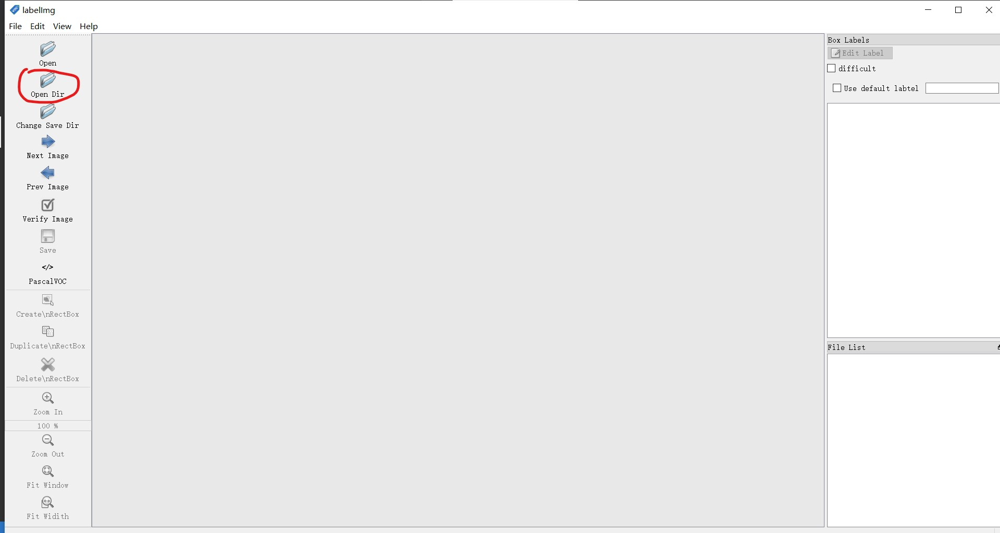
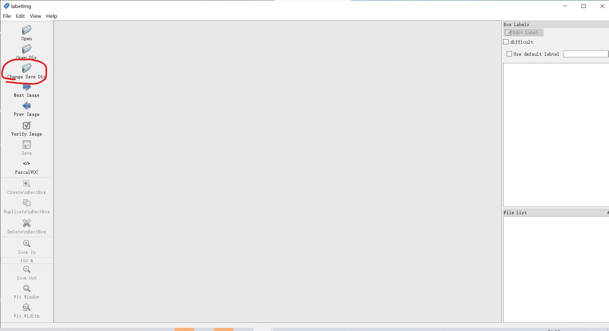
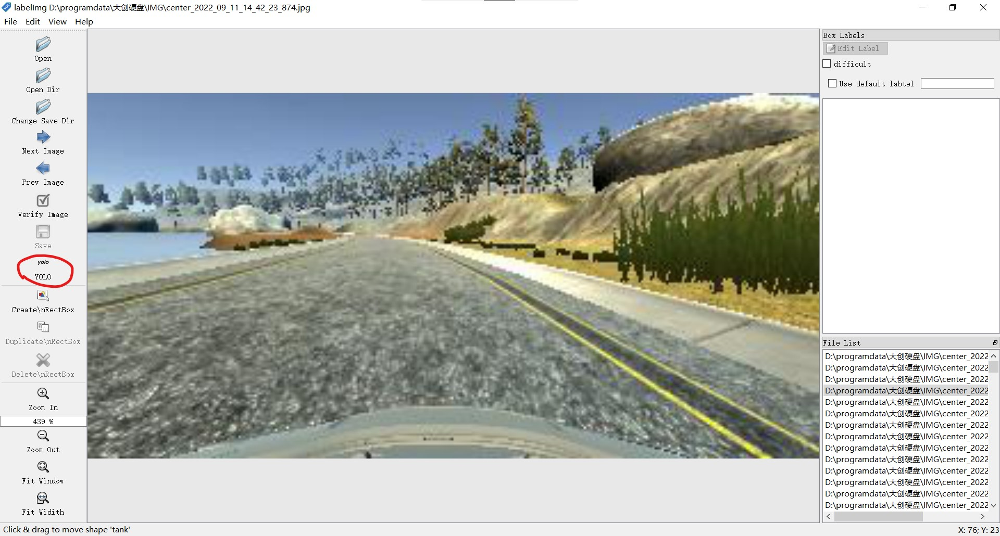

# yolov5训练手册
## 1. 数据集制作
### 1.1. 数据集制作工具下载链接
- labelImg工具根据标注系统选择下载
    - [windowsV1.8.0](https://github.com/tzutalin/labelImg/releases)
    - [ubuntu](https://blog.csdn.net/sunchanglan151/article/details/116855746)
### 1.2. 数据集制作流程
- 1.下载labelImg工具
- 2.打开labelImg工具
- 3.打开图片文件夹

- 4.选择保存标签的文件夹

- 5.选择标注模式(显示为yolo格式)
 
- 6.标注图片(注意保存)

## 2. 数据集划分
### 2.1. 数据集划分工具
- train_test_split工具()
### 2.2. 数据集划分流程
- 将classes.txt文件移动到其他位置以备后续使用


```
cd tools   #打开train_test_split.py文件所在路径
python train_test_split.py --image-dir my_datasets/color_rings/imgs --txt-dir my_datasets/color_rings/txts --save-dir my_datasets/color_rings/train_data       
```
   --image-dir：训练图片目录；

   --txt-dir：标签路径；
   
   --save-dir：切分数据集存放路径

## 3. yolov5文件准备
### 3.1. yolov5文件
- yolov5文件

    github中克隆yolov5文件

    ```
    git clone https://github.com/ultralytics/yolov5.git
    ```
### 3.2. yolov5配置文件修改
- 修改data/coco128.yaml文件内容
    - 修改文件路径
    
        修改为自己的数据集路径(划分中的保存文件夹)只需修改path参数为保存路径，train、val如图填写
       ```python
       # Train/val/test sets as 1) dir: path/to/imgs, 2) file: path/to/imgs.txt, or 3) list: [path/to/imgs1, path/to/imgs2, ..]
       path: /save-dir  #划分步骤中save-dir的绝对路径
       train: train  # train images (relative to 'path') 128 images
       val: val  # val images (relative to 'path') 128 images
       test:  # test images (optional)
         ```

    - 修改classes

        修改为自己的类别数与种类与classes.txt中的类别数与种类顺序一致，多删少补

    - 注释download参数

        注释掉download参数，不下载coco128数据集

## 4. yolov5训练
```
cd yolov5-master  #打开yolov5文件夹
python3 train.py --img 1056 --batch 16 --epochs 3 --data data/coco128.yaml  --weights yolov5s.pt 
```
- --img：图片大小(32整数倍)
- --batch：batch大小
- --epochs：训练轮数
- --data：数据集配置文件
- --weights：预训练模型
## 5. yolov5测试
```
cd yolov5-master  #进入yolov5文件夹
python3 detect.py --source /训练图片路径 --weights ./runs/train/exp*(最后一个)/weights/best.pt 
```
- --source：测试图片路径
- --weights：训练好的模型路径
- --save-txt：保存预测结果txt文件


